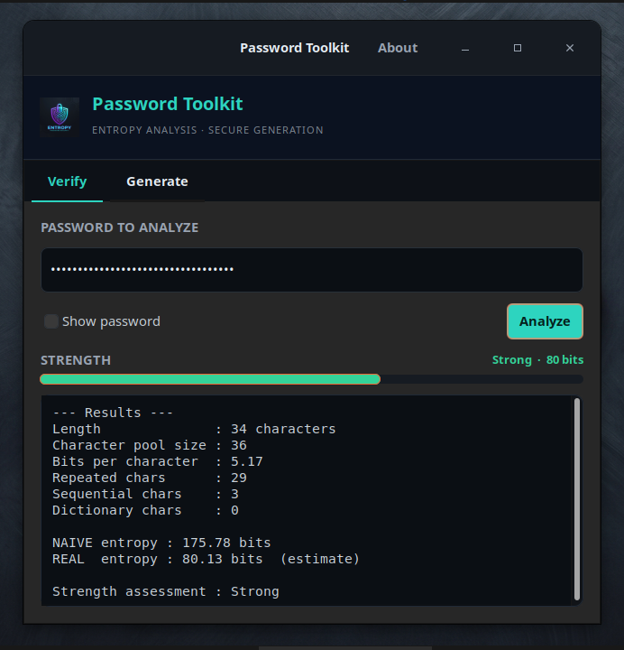

<h1 align="center">🔐 Password Toolkit <sub>(GUI Edition)</sub></h1>

<p align="center">
  The GUI version of Password Toolkit — a sleek <strong>GTK3</strong> desktop app for analyzing password entropy and generating cryptographically secure passwords.
</p>

<p align="center">
  
  
  
  
  
  
  
</p>

---

## 📖 Overview

**Password Toolkit** is a small, fast GTK3 desktop application for **password
security**. It analyzes the entropy of a password (theoretical vs. a realistic
estimate) and generates strong passwords using a cryptographically secure random
number generator.

- 🧮 **Verify entropy** — naive (`length × log2(pool)`) vs. an estimated *real*
  entropy that penalizes repeats, sequences, dictionary words, leet-speak, and
  low character variety.
- 🎲 **Generate passwords** — choose length and character classes; bytes come
  from `getrandom()` (a CSPRNG) with unbiased rejection sampling, so the output
  is safe for real use.
- 🌈 **Color-coded strength meter** and a one-click copy to clipboard.
- 🎨 Sleek dark "security console" theme, opens centered on screen.

---

## 📸 Screenshot

<p align="center">
  
</p>

---

## 📦 Prerequisites

You need a C compiler, `make`, `pkg-config`, and the **GTK 3** development
headers. The app was built and tested against GTK **3.24**.

### Debian / Ubuntu / Linux Mint

```bash
sudo apt update
sudo apt install build-essential pkg-config libgtk-3-dev
```

### Fedora / RHEL / CentOS

```bash
sudo dnf install gcc make pkgconf-pkg-config gtk3-devel
```

### Arch / Manjaro

```bash
sudo pacman -S base-devel gtk3
```

### openSUSE

```bash
sudo zypper install gcc make pkg-config gtk3-devel
```

---

## 🔨 Compile

From the project directory:

```bash
make
```

This produces an `entropy` executable. To run it without installing:

```bash
make run        # or: ./entropy
```

To remove build artifacts:

```bash
make clean
```

---

## 🚀 Install (system-wide)

Installing puts the binary on your `PATH`, registers a desktop launcher, and
installs the icon globally so it shows up in your application menu and the
taskbar.

```bash
sudo make install
```

This installs:

| File | Destination |
|------|-------------|
| `entropy` binary | `/usr/local/bin/entropy` |
| Icon | `/usr/local/share/icons/hicolor/256x256/apps/entropy.png` |
| Desktop entry | `/usr/local/share/applications/entropy.desktop` |

After installing you can launch it from your application menu as
**Password Toolkit**, or from a terminal:

```bash
entropy
```

To uninstall everything:

```bash
sudo make uninstall
```

> The install prefix defaults to `/usr/local`. To install elsewhere, override
> `PREFIX`, e.g. `sudo make install PREFIX=/usr`.

---

## 🖱️ Usage

The window opens centered on screen with two tabs.

### Verify tab

1. Type or paste a password into the field (spaces are allowed).
2. Toggle **Show password** if you want to see what you typed.
3. Click **Analyze** (or press <kbd>Enter</kbd>).

You'll get a color-coded **strength meter** plus a detailed report:

```
--- Results ---
Length              : 16 characters
Character pool size : 94
Bits per character  : 6.55
Repeated chars      : 0
Sequential chars    : 0
Dictionary chars    : 0

NAIVE entropy : 104.87 bits
REAL  entropy : 104.87 bits  (estimate)

Strength assessment : Strong
```

**How to read it:** *NAIVE* entropy assumes every character is independent and
random. *REAL* entropy is an estimate that subtracts penalties for predictable
patterns (repeats, sequences like `abc`/`123`, dictionary words, and `l33t`
substitutions). The verdict scale is:

| Estimated entropy | Verdict |
|-------------------|---------|
| < 28 bits | Very weak |
| 28–35 bits | Weak |
| 36–59 bits | Reasonable |
| 60–127 bits | Strong |
| ≥ 128 bits | Very strong |

### Generate tab

1. Set the **length**.
2. Tick the **character classes** to include (lowercase, uppercase, numbers,
   symbols).
3. Click **Generate Secure Password**.
4. Click **Copy** to put it on your clipboard.

The generator retries until every selected class is represented (when the length
allows), and immediately shows the new password's strength.

---

## 🧠 How entropy is estimated

```
NAIVE = length × log2(pool_size)

REAL  = NAIVE − penalties, where penalties come from:
          • repeated characters
          • sequential runs (abc, 321, ...) within one class
          • coverage by a built-in dictionary of common words/passwords
          • leet-speak normalization (0→o, 3→e, @→a, ...)
          • using only a single character class
```

The repeat penalty is capped so that a long password drawn from a small pool
isn't unfairly driven to zero.

---

## 📄 License

Provided as-is for personal and educational use.

## 👤 Author

**Jean-Francois Lachance-Caumartin**
